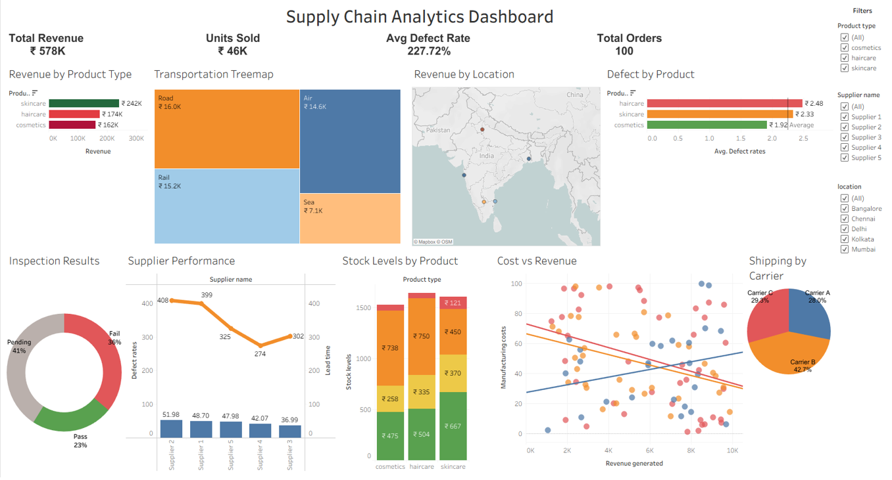

# Supply-Chain-Management-Dashboard-Project
This project focuses on analyzing supply chain operations using Tableau to improve inventory management, delivery performance, sales tracking, and operational efficiency.
The dashboard provides interactive visualizations and actionable insights for decision-making.

---

## Tools & Technologies Used

- Tableau
- CSV Dataset
- Data Visualization
- Supply Chain Analytics

---

## Features

- Sales Performance Analysis
- Inventory Tracking
- Order Status Monitoring
- Supplier Performance Analysis
- Shipment Insights
- KPI Tracking Dashboard

---

## Key Insights

- Identified delayed shipment patterns
- Tracked high-performing suppliers
- Improved inventory visibility
- Analyzed sales trends across categories

---

## Project Structure

Supply-Chain-Management-Dashboard/
│
├── data/
│   └── supply_chain_data.csv
│
├── Tableau Dashboard/
│   └── Supply Chain Analytics Dashboard.twb
│
├── screenshots/
│   └── dashboard.png
│
├── Project Report/
│   └── Supply Chain Management Dashboard Project.pdf
│
├── Error Handling Note.txt
├── LICENSE
├── README.md
└── requirements.txt

---

## Dashboard Preview

---

## How to Use

1. Download the repository
2. Open Tableau Workbook (.twb)
3. Connect `supply_chain_data.csv`
4. Refresh data source
5. Explore dashboard insights

---

## Dataset

The dataset contains:
- Orders
- Shipment details
- Inventory data
- Supplier information
- Sales records

---

## Future Improvements

- Real-time dashboard integration
- SQL database connectivity
- Predictive analytics
- Power BI version

---

## Author

Konki Mohit
